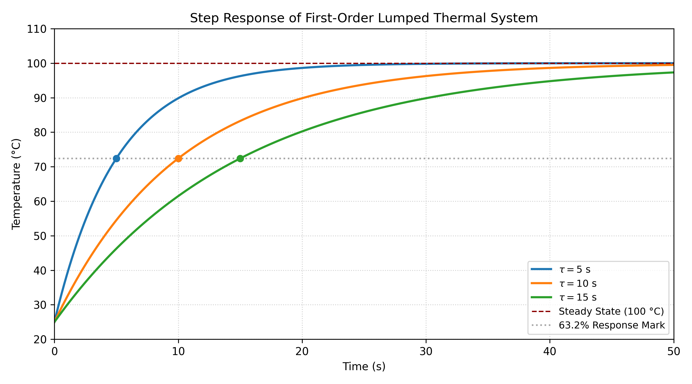

# Step Response Analysis of a Lumped Thermal System

A dynamic simulation and transient analysis of a first-order thermal system subjected to step temperature perturbations.

## Theoretical Framework
Under the lumped capacitance assumption ($Bi < 0.1$), the dynamic energy conservation equation is given by:

$$m C_p \frac{dT(t)}{dt} = h A (T_\infty - T(t))$$

Rearranging into standard first-order transfer function form:

$$\tau \frac{dT(t)}{dt} + T(t) = T_\infty$$

where the thermal time constant is $\tau = \frac{m C_p}{h A} = R_{th} C_{th}$.

For a step change in ambient temperature $\Delta T = T_\infty - T_0$, the analytical solution is:

$$T(t) = T_0 + \Delta T \left(1 - e^{-t/\tau}\right)$$

## Methodology & Analysis
- Simulated system trajectories across multiple thermal time constants ($\tau = 5\,\text{s}, 10\,\text{s}, 15\,\text{s}$).
- Verified the standard transient metric where the system attains **63.2% of its total response at $t = \tau$** and approaches steady state ($\approx 99.3\%$) at $t = 5\tau$.
- Automated visualization scripts using `matplotlib` and `numpy` to map step response trajectories and system damping behavior.

## Dynamic Response

